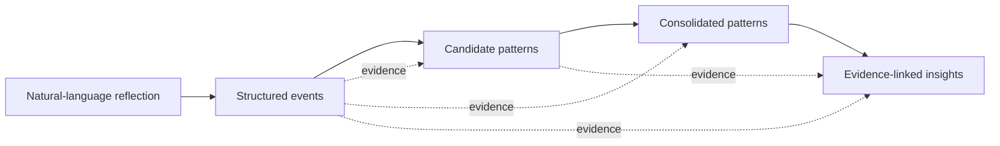

# InnerMap

**An experimental AI MVP for transforming longitudinal natural-language reflections into structured, evidence-linked patterns and insights.**

## Overview

InnerMap is an independent AI project exploring whether unstructured personal reflections can be converted into structured information that supports more cautious, longitudinal pattern recognition.

The current workflow is:

**Unstructured reflection → Structured events → Candidate patterns → Consolidated patterns → Evidence-linked insights**

The project originated from my interest in psychology, behavioural patterns and self-understanding, and from a question:

> Can an AI system identify recurring patterns across reflections without turning a single event into an unsupported conclusion?

InnerMap is currently a **functional local MVP under active iteration**. It is not a production application, diagnostic tool or replacement for professional psychological support.

---

## Why I built it

General-purpose LLM conversations can respond well to individual reflections, but they do not necessarily provide a transparent structure for understanding how conclusions emerge across many separate experiences.

I wanted to experiment with a system that could:

- extract structured events from natural-language reflections;
- preserve information across sessions;
- identify possible recurring patterns;
- distinguish tentative observations from more strongly supported patterns;
- link higher-level insights back to the evidence that produced them.

The emphasis is therefore not simply on generating an AI response, but on **evidence accumulation, traceability and conservative interpretation**.

---

## Architecture

The current prototype uses separate workflow stages for:

1. **Event extraction**  
   Natural-language reflections are transformed into structured events.

2. **Candidate-pattern detection**  
   Potential recurring behaviours or dynamics are stored as candidate patterns rather than immediately treated as persistent patterns.

3. **Pattern consolidation**  
   Candidate patterns can be combined into broader patterns when sufficient supporting evidence accumulates.

4. **Insight generation**  
   Higher-level reflective summaries reference the patterns, candidate patterns and events that support them.

A separate people-resolution layer also helps maintain continuity when the same person is referenced differently across reflections.

## Key design decision: candidate patterns
One of the most important design choices was introducing an intermediate **candidate-pattern layer**.

A single event should not automatically become evidence of a persistent behavioural pattern.

Instead, potential patterns can remain tentative while additional evidence accumulates across events and sessions.

Candidate patterns retain information such as:

- supporting event references;
- number of supporting events;
- number of sessions represented;
- contextual diversity;
- consistency;
- confidence rationale.

Consolidated patterns can therefore remain hypotheses when the available evidence is limited or concentrated within one context.

This was designed to reduce premature interpretation and make the reasoning process more traceable.

## Evidence traceability

InnerMap maintains links between the different abstraction levels:

**Insight → Consolidated pattern → Candidate pattern → Event**

This makes it possible to inspect what evidence contributed to a higher-level interpretation rather than presenting the final LLM output as an unsupported conclusion.

## Technology

Technologies used in the current prototype include:

- **Python** — pipeline orchestration and supporting logic
- **Langflow** — LLM workflow construction
- **OpenAI / LLM workflows** — structured extraction and synthesis
- **Streamlit** — local user interface
- **JSON** — local persistence
- **Git** — version control

The project was developed with substantial **AI-assisted coding**. My primary contribution has been the problem definition, architecture, workflow design, information structure, iterative testing and refinement of the system rather than advanced software engineering.

## What I worked on

I designed and iterated on:

- the overall system architecture;
- the event → candidate pattern → pattern → insight hierarchy;
- the candidate-pattern concept;
- evidence-linking between abstraction layers;
- longitudinal memory structure;
- workflow orchestration;
- people/entity continuity across sessions;
- prompt and output structure;
- iterative testing using multiple reflection scenarios;
- the local Streamlit MVP used to inspect pipeline outputs.

## Current status

**Functional local MVP under active iteration.**

The current version focuses on validating the information architecture and pattern-consolidation workflow rather than production deployment.

The prototype can process reflections through the different stages and persist structured outputs locally, but setup still requires local services and configuration.

## Limitations

Current limitations include:

- local-only architecture;
- manual local environment setup;
- JSON-based persistence rather than a production data layer;
- heuristic / LLM-generated confidence indicators rather than statistically calibrated probabilities;
- limited testing data;
- iterative qualitative testing rather than a formal LLM evaluation framework;
- output quality remains dependent on LLM behaviour and prompt design;
- several components still assume the current local project structure;
- the interface is an MVP rather than a polished end-user application.

Because reflections may contain highly sensitive information, real development data is intentionally excluded from this public repository.

## Privacy

No real personal reflections or identifiable user data are included in this repository.

Any demonstration data added to the repository will be explicitly labelled as **synthetic**.

API credentials and local environment files are also excluded from version control.

## Next steps

Planned improvements include:

- replacing development examples with a small synthetic demonstration dataset;
- making local paths and configuration more portable;
- improving output validation between workflow stages;
- expanding systematic test cases and evaluation criteria;
- improving the Streamlit interface;
- exploring clearer visual representations of evidence accumulation and pattern evolution.

## Project context

InnerMap is an independent learning and experimentation project combining my interests in **data, AI and behavioural science**.

The project is intended to demonstrate my approach to problem framing, structured data design, experimentation and human-centred AI rather than to present a production-ready software product.